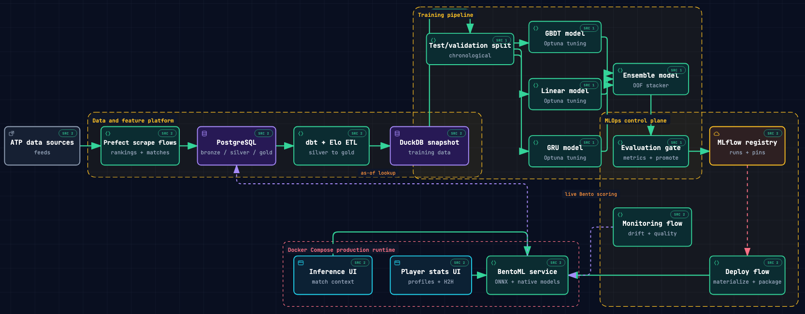

# tennis-ml



Tennis match predictions end to end. I made this repo with the goal of learning modern MLOps, deploying a full stack pipeline with automated ingestion, training, evaluation, promotion, deployment, and a nice UI to boot. I love tennis, and so I built a simple and fun way to look up stats and match predictions, and avoiding the ATP website as much as possible (which is a true eyesore).

- [Click here for full map](https://swang62.github.io/tennis-ml/)

## Core Features

| Layer               | Tool                                       |
| ------------------- | ------------------------------------------ |
| Orchestration       | Prefect (cron, scraping, ETL triggers)     |
| Experiment tracking | MLflow (model registry, trial comparison)  |
| Model serving       | BentoML, Docker                            |
| Web app             | React, TypeScript, Vite, TanStack, ECharts |
| Data warehouse      | PostgreSQL, dbt                            |
| Development         | Jupyter + Papermill, Optuna                |
| Monitoring          | Evidently drift checks, Brier calibration  |

## Web Dashboard

React 19 + TypeScript dashboard built with Vite, Tailwind CSS 4, TanStack, and ECharts.

- **Player directory** — MiniSearch fuzzy search over the player list.
- **Player similarity** — FAISS search using service/return statistics.
- **Head-to-head** — cumulative charts and per-model win probabilities.
- **SEO** — canonical, Open Graph, JSON-LD, robots, and sitemap metadata.

## Quick Start for Local Dev

Requirements: [DagsHub](https://dagshub.com), [Docker](https://www.docker.com/), [Just](https://just.systems/), and `uv`.

```bash
# 1. Install dependencies and create the local cluster
just deps && just cluster-create

# 2. Add a working Postgres DB to DATABASE_URL, then run
just migrate && just seed

# 3. Build silver and gold
just etl

# 4. Start local Bento and Vite services
just dev

# 5. Optional use serviceman to run Prefect worker automations
serviceman <start|restart> tennis-prefect-worker
serviceman logs tennis-prefect-worker
```

## Data Architecture

```
Rankings and match data → PostgreSQL bronze raw match and player data
                        → dbt silver: player-perspective matches and rolling features
                        → dbt gold: training rows, player profiles, and tour averages
                        → training and evaluation
                        → gated-promotion MLflow `@champion`
                        → BentoML serving and frontend webapp
                        → weekly Prefect drift monitoring
```

## ML Modeling Techniques

Training uses gold match features: each physical match produces both orientations with complementary binary labels. Features are built from information available before the match to prevent data leakage.

### Validation and tuning

- **Time-forward CV folds** — training uses strictly earlier matches compared to validation/test sets. Out-of-fold (OOF) predictions for ensemble training
- **Match-safe grouping** — both orientations of a physical match stay in the same fold, preventing leakage.
- **Stratification** — every validation fold preserves the one-positive/one-negative directional label balance.
- **Optuna tuning** — each model family is tuned independently against validation log loss.
- **Early stopping** — GBDT models stop when validation loss stops improving
- **Recency Weighting** - Recent matches are weighted more heavily to reflect the current tennis meta. Exponential decay with a half-life.

### Base models

- **Linear family:** logistic regression and Gaussian Naive Bayes.
- **Gradient boosting:** XGBoost and LightGBM, with early stopping.
- **Neural network:** GRU encodes each player's temporal match-sequence features into per-side embeddings.

### Evaluation and Promotion

Candidate and production models are compared on cross-fitted held-out test predictions using:

- **Log loss** — primary probability-quality metric.
- **ROC-AUC** — secondary ranking quality.
- **Brier score** — probability calibration to actual match wins.
- **Accuracy** — used only for inspecting classification quality.

### Drift Monitoring

The weekly drift flow scores new production data through the champion Bento and compares it with a size-matched historical reference window. It checks:

- PSI for monitored input features and prediction probabilities.
- Current-window ROC-AUC and calibration against the champion's pinned metrics.

## Data Pipelines

- `rankings.py` — weekly ATP rankings catch-up (scheduled deployment).
- `matches.py` — match-stats enrichment (scheduled deployment).
- `seed.py` — load matches and rankings into bronze, with optional Wikipedia enrichment.
- `etl.py` — build bronze → silver → gold tables with dbt. 3 phase with stateful ELO calculations.
- `pipeline.py` — snapshot production data, train and score base models, build the ensemble stacker, evaluate, and promote.
- `drift.py` — compare current production data and performance with the champion.
- `deploy.py` — materialize the champion's serving artifacts and publish the Bento image. Full lineage tracking of experiments and parameters.

## Production Serving & Inference

### Docker Overview

| Service    | Image source           | Host port      | Purpose       |
| ---------- | ---------------------- | -------------- | ------------- |
| `postgres` | `postgres:18.4`        | 6543           | Feature store |
| `bento`    | `swang62/tennis-bento` | internal proxy | Model API     |
| `web`      | `swang62/tennis-web`   | 8187           | Dashboard     |
| `metabase` | `metabase/metabase`    | 3000           | BI analytics  |

| Var                 | Purpose                                                                     |
| ------------------- | --------------------------------------------------------------------------- |
| `POSTGRES_PASSWORD` | PostgreSQL password; bento's `DATABASE_URL` derives from it                 |
| `BENTO_API_KEY`     | Authenticates the `/api/model_info` and `/api/predict_from_ids_bulk` routes |

```bash
cp .env.example .env
docker compose up -d
```

### Inference schema

The `/predict_from_ids` endpoint accepts a JSON object with the following fields:

| Input         | Required | Default | Valid values                                       |
| ------------- | -------- | ------- | -------------------------------------------------- |
| `player_id`   | yes      | —       | non-empty str                                      |
| `opponent_id` | yes      | —       | non-empty str                                      |
| `surface`     | yes      | —       | `clay` / `grass` / `hard` / `carpet`               |
| `tournament`  | no       | —       | `grand_slam` / `masters` / `atp_500` / `atp_250`   |
| `round`       | no       | —       | `r128` / `r64` / `r32` / `r16` / `qf` / `sf` / `f` |
| `as_of_date`  | no       | today   | `datetime.date`                                    |

## Acknowledgements

Huge shoutout to [TennisMyLife](https://stats.tennismylife.org/) for providing me with the inspiration and data sources.

- [Jeff Sackmann](https://github.com/JeffSackmann) — decades of match-level results, despite removing them from GitHub recently
- [Prefect](https://www.prefect.io/) — workflow orchestration for the weekly scrape, ETL, and drift monitoring
- [MLflow](https://mlflow.org/) — experiment tracking and the model registry behind the `@champion` alias
- [BentoML](https://www.bentoml.com/) — model serving

## License

MIT — see [LICENSE](LICENSE).
